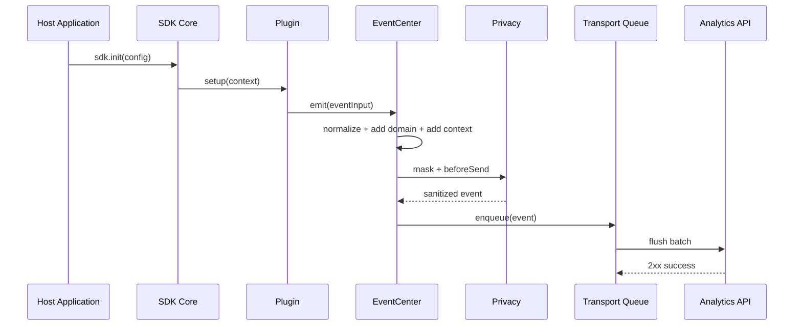

# 前端数据采集 SDK 项目架构

本文描述 SDK V1 的推荐目录结构、模块边界、数据流、插件协议和关键实现约束。

## 1. 架构目标

- 核心稳定，插件可替换。
- 数据先标准化，再入队，再发送。
- 隐私规则在事件进入队列前统一执行。
- 插件之间不互相依赖。
- SDK 销毁后不残留监听、计时器、patch 或未完成任务。

## 2. 推荐目录结构

```text
custom-sdk/
  src/
    index.ts
    core/
      sdk.ts
      config.ts
      context.ts
      plugin-runtime.ts
      logger.ts
    identity/
      identity.ts
      session.ts
      storage-keys.ts
    event/
      event-center.ts
      domain.ts
      normalize.ts
      schema.ts
      sampling.ts
    privacy/
      mask.ts
      url.ts
      consent.ts
      before-send.ts
    lifecycle/
      page-context.ts
      route-listener.ts
      visibility.ts
    transport/
      queue.ts
      sender.ts
      pixel.ts
      retry.ts
      payload.ts
    storage/
      memory.ts
      indexed-db.ts
      local-storage.ts
    plugins/
      operation/
        conversion.ts
        metadata.ts
      page/
        index.ts
      click/
        index.ts
        selector.ts
      exposure/
        index.ts
      replay/
        index.ts
        snapshot.ts
        mutation.ts
        chunk.ts
      heatmap/
        index.ts
        grid.ts
        aggregate.ts
      error/
        index.ts
        normalize-error.ts
      api/
        index.ts
        fetch.ts
        xhr.ts
      performance/
        index.ts
        web-vitals.ts
      diagnostic/
        index.ts
    types/
      public.ts
      internal.ts
  tests/
    unit/
    browser/
  examples/
    basic/
  docs/
    sdk/
```

## 3. 模块边界

### 3.1 `core`

负责：

- 对外 API。
- 配置合并和校验。
- 插件注册和生命周期。
- SDK 状态管理。
- 对内部模块提供 `SDKContext`。

不负责：

- 具体事件采集。
- 网络发送细节。
- 隐私规则细节。

### 3.2 `identity`

负责：

- `distinct_id` 生成、读取和持久化。
- `session_id` 生成、续期和过期判断。
- `user_id` 登录和退出。

约束：

- 不读取 Cookie。
- 不上传本地存储中的原始结构。
- 所有 ID 都只作为 SDK 事件标识，不承担鉴权语义。

### 3.3 `event`

负责：

- 把插件输入转换为统一 `SDKEvent`。
- 为事件注入 `domain`，区分运营侧、开发者侧和共享上下文。
- 注入公共上下文。
- 执行采样。
- 调用隐私处理。
- 将事件交给 `Transport`。

约束：

- SDK 内置字段不可被业务覆盖。
- 事件名必须是非空字符串。
- `domain` 只能是 `operation`、`developer` 或 `shared`。
- 单条事件序列化后需要有大小上限。

### 3.4 `privacy`

负责：

- URL query 脱敏。
- DOM 文本脱敏。
- 异常 message 和 stack 脱敏。
- consent 状态控制。
- `beforeSend` 最终过滤。

约束：

- 隐私处理必须发生在事件入队前。
- `beforeSend` 返回 `false` 时丢弃事件。
- `beforeSend` 抛错时保留原事件并记录 debug 日志，不影响主流程。

### 3.5 `lifecycle`

负责：

- 获取页面上下文。
- 监听页面可见性变化。
- 监听 SPA 路由变化。
- 提供页面停留时长计算依据。

约束：

- patch `history.pushState` 和 `history.replaceState` 必须可恢复。
- 重复初始化不得重复 patch。

### 3.6 `transport`

负责：

- 内存队列。
- 批量发送。
- 像素 GET 上报。
- 重试和退避。
- 离场上报。
- 离线缓存协调。

约束：

- 传输层不关心插件类型。
- 传输失败不能抛出到宿主应用。
- SDK 采集 endpoint 必须加入 API 监控排除列表。
- 所有上传只允许使用 Pixel GET，URL 超长时必须截断、摘要化或丢弃。

### 3.7 `storage`

负责：

- IndexedDB 离线事件持久化。
- localStorage 降级缓存。
- 缓存容量、过期和清理。

约束：

- 本地缓存不保存未脱敏原始数据。
- 写入失败时需要降级或丢弃，不能阻塞主线程过久。

### 3.8 `plugins`

负责：

- 具体采集能力。
- 监听浏览器事件。
- 生成插件事件输入。

约束：

- 插件不得直接发送网络请求。
- 插件不得直接读取或修改其他插件状态。
- 插件必须支持 `destroy`。

### 3.9 `operation`

负责：

- 运营侧采集能力的默认配置。
- 转化事件封装。
- 运营公共属性规范，例如渠道、活动、实验、租户。
- 点击和曝光声明式字段映射。

约束：

- 运营侧事件默认不包含异常堆栈、API 细节和 SDK 诊断细节。
- 点击和曝光只采集声明字段或脱敏后的安全文本。
- 转化事件必须由业务显式调用。

### 3.10 `developer`

负责：

- 开发者侧异常、API、性能和自诊断采集策略。
- 错误指纹、性能评分、接口状态归一化。
- SDK 降级、重试、缓存、丢弃等诊断状态。

约束：

- 开发者侧事件默认不采集请求体、响应体、Cookie 和输入值。
- SDK 自诊断事件必须限频。
- API 采集默认关闭，开启后必须排除采集 endpoint。

### 3.11 `replay` 和 `heatmap`

负责：

- 录屏 DOM 快照、增量变化、点击、滚动、路由变化采集。
- 热力图点击、滚动、移动、曝光数据本地聚合。
- 分片、压缩、摘要化和 URL 长度控制。

约束：

- 默认关闭，必须显式开启并受 consent 控制。
- 不采集输入框真实值、Cookie、Token、请求体和响应体。
- 不采集 Canvas 像素、视频帧、音频和跨域 iframe 内容。
- 不直接调用传输层，只通过 `EventCenter` 入队。
- 只能通过 `aly.gif` 像素请求上传分片或聚合结果。

## 4. 数据流



## 5. 插件协议

```ts
export interface SDKContext {
  config: SDKConfig;
  track(event: string, properties?: Record<string, unknown>): void;
  conversion(conversionId: string, properties?: Record<string, unknown>): void;
  emit(input: SDKEventInput): void;
  getIdentity(): IdentitySnapshot;
  getPageContext(): PageContext;
  setActive(): void;
  logger: SDKLogger;
}

export interface Plugin<TOptions = unknown> {
  name: string;
  setup(context: SDKContext, options?: TOptions): void | Promise<void>;
  destroy?(): void;
}
```

## 6. 初始化流程

```text
sdk.init(config)
  -> merge default config
  -> validate required fields
  -> initialize logger
  -> initialize consent
  -> initialize identity
  -> initialize lifecycle
  -> initialize event center
  -> initialize transport
  -> register built-in plugins
  -> setup enabled plugins
  -> emit initial $pageview
```

## 7. 销毁流程

```text
sdk.destroy()
  -> stop flush timer
  -> flush remaining queue when allowed
  -> call plugin.destroy()
  -> restore history patch
  -> restore fetch/XMLHttpRequest patch
  -> remove event listeners
  -> close storage handles
  -> mark SDK as destroyed
```

## 8. 关键接口建议

```ts
export interface SDK {
  init(config: SDKConfig): void;
  use<TOptions>(plugin: Plugin<TOptions>, options?: TOptions): void;
  track(event: string, properties?: Record<string, unknown>): void;
  conversion(conversionId: string, properties?: Record<string, unknown>): void;
  register(properties: Record<string, unknown>): void;
  unregister(key: string): void;
  login(userId: string): void;
  logout(): void;
  setConsent(consent: boolean): void;
  flush(): Promise<FlushResult>;
  destroy(): void;
}
```

## 9. 配置结构建议

```ts
export interface SDKConfig {
  appId: string;
  endpoint: string;
  debug?: boolean;
  batchSize?: number;
  flushInterval?: number;
  maxQueueSize?: number;
  sampleRate?: number;
  requestTimeout?: number;
  transport?: {
    pixelEndpoint?: string;
    pixelMaxUrlLength?: number;
    cacheBust?: boolean;
  };
  modules?: {
    operation?: OperationModuleConfig;
    developer?: DeveloperModuleConfig;
  };
  replay?: ReplayConfig;
  heatmap?: HeatmapConfig;
  plugins?: PluginConfig;
  privacy?: PrivacyConfig;
  beforeSend?: (event: SDKEvent) => SDKEvent | false;
}
```

## 10. 传输调度

```text
Event Queue
  -> Transport Scheduler
       -> pixel sender
            -> GET /aly.gif?... as image request
       -> offline storage
```

调度规则：

| 条件 | 处理方式 |
| --- | --- |
| 常规事件 | 编码为 `aly.gif` query 参数后上报。 |
| 队列 flush | 拆成多条 `aly.gif?...` 图片请求。 |
| 页面离开 | 提前触发像素请求，不等待响应。 |
| URL 超过阈值 | 删除低优先级字段、截断长字段或摘要化。 |
| 截断后仍超限 | 丢弃当前事件并记录诊断。 |
| 网络失败 | 重试后写入离线缓存。 |

Pixel GET 固定端点：

```text
GET /aly.gif?ti=demo-web&evt=pageLoad&dm=operation&rn=175454
```

服务端推荐返回 1x1 透明 GIF，并设置 `Cache-Control: no-store`。

## 11. 双模块事件路由

```text
Plugin/Event Input
  -> detect or set domain
  -> operation domain
       -> behavior/conversion normalization
       -> operation privacy policy
       -> queue
  -> developer domain
       -> error/api/performance/diagnostic normalization
       -> developer privacy policy
       -> queue
  -> shared context
       -> identity/page/device/network/properties
```

事件域映射：

| 事件 | domain | type |
| --- | --- | --- |
| `$pageview` | `operation` | `behavior` |
| `$pageleave` | `operation` | `behavior` |
| `$click` | `operation` | `behavior` |
| `$exposure` | `operation` | `behavior` |
| `$conversion` | `operation` | `conversion` |
| `$replay_start` | `operation` | `replay` |
| `$replay_chunk` | `operation` | `replay` |
| `$replay_end` | `operation` | `replay` |
| `$heatmap_click` | `operation` | `heatmap` |
| `$heatmap_scroll` | `operation` | `heatmap` |
| `$heatmap_move` | `operation` | `heatmap` |
| `$heatmap_exposure` | `operation` | `heatmap` |
| `$js_error` | `developer` | `error` |
| `$promise_error` | `developer` | `error` |
| `$resource_error` | `developer` | `error` |
| `$api` | `developer` | `api` |
| `$web_vitals` | `developer` | `performance` |
| `$sdk_diagnostic` | `developer` | `diagnostic` |

## 12. 状态机

```text
created
  -> initialized
  -> running
  -> flushing
  -> running
  -> destroyed
```

异常状态：

- `init_failed`：配置缺失或关键模块初始化失败。
- `plugin_failed`：某个插件失败，不影响 SDK 整体运行。
- `transport_degraded`：像素请求、网络或存储降级。

## 13. 并发与幂等

- `init` 重复调用时应忽略或先 `destroy` 再初始化，V1 建议忽略并输出 debug 警告。
- `use` 重复注册同名插件时忽略后续注册。
- `flush` 并发调用时复用同一个发送过程。
- `destroy` 可重复调用。
- `login` 多次调用以后一次为准。

## 14. 可测试性设计

为了便于测试，核心模块应支持依赖注入：

- `now()`：控制时间。
- `randomId()`：控制 ID。
- `sender`：模拟网络成功、失败和超时。
- `pixelSender`：模拟图片加载成功、失败和超时。
- `storage`：模拟 IndexedDB 不可用。
- `logger`：断言 debug 输出。

## 15. 架构验收标准

- 新增一个插件时不需要修改 `Transport`。
- 新增一种传输方式时不需要修改插件。
- 隐私处理在所有插件事件上统一生效。
- SDK 销毁后浏览器全局对象恢复到初始化前状态。
- 采集 endpoint 不会被 API 插件递归采集。
- 单个插件异常不会导致 `track`、页面采集或传输不可用。
- 运营侧和开发者侧事件都能按 `domain` 独立过滤、查询和验收。
- 上传链路只存在 Pixel GET，不能出现其他上传分支。
- 录屏和热力图插件默认关闭，开启后仍只能通过 `aly.gif` 分片或聚合上传。
