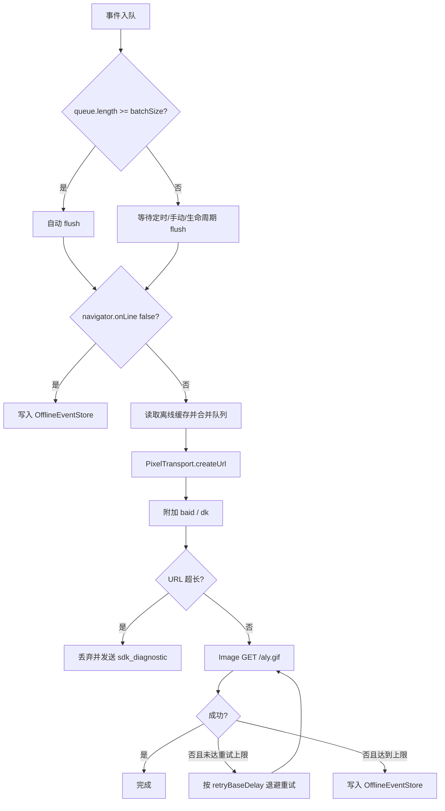

# 可靠像素推送方案

本文记录可靠推送层 V1 的实现：`batchSize` 自动 flush、失败重试、离线缓存和网络恢复补发。

## 1. 目标

SDK 仍然只使用像素级上报：

```text
GET /aly.gif?...
```

可靠推送层只增强“何时发、失败怎么办、离线怎么办”，不改变上传形态。

## 2. 已实现能力

| 能力 | 当前实现 |
| --- | --- |
| `batchSize` | 事件队列达到阈值后自动触发 `flush()`。 |
| 失败重试 | `transport.retryCount` 控制重试次数，`retryBaseDelay` 控制指数退避起点。 |
| 离线判断 | `navigator.onLine === false` 时不发像素请求。 |
| 离线缓存 | 优先 IndexedDB，浏览器不支持时回退到 `localStorage`。 |
| 网络恢复 | 监听 `online` 事件，恢复后自动 `flush()` 补发。 |
| 补发可见性 | 离线恢复事件会带 `delivery_status=offline_replayed`，后台统计“离线补发”。 |
| 幂等去重 | 每条像素请求带 `baid` 和 `dk`，服务端按 `dk` 去重。 |

## 3. 配置示例

```ts
sdk.init({
  appId: "demo-web",
  endpoint: "/aly.gif",
  batchSize: 10,
  flushInterval: 5000,
  transport: {
    pixelEndpoint: "/aly.gif",
    pixelMaxUrlLength: 1800,
    retryCount: 2,
    retryBaseDelay: 300,
    offlineMaxEvents: 1000
  }
});
```

## 4. 发送流程



## 5. 存储策略

`OfflineEventStore` 使用：

- IndexedDB：数据库 `custom-analytics-sdk`，对象仓库 `events`。
- localStorage fallback：`__custom_sdk_offline_events__:<appId>`。
- 测试兼容 key：`__custom_sdk_offline_events__`。

缓存只保存脱敏后的 `SDKEvent`，不会额外采集 Cookie、输入框值、请求体或响应体。

## 6. 当前限制

- V1 只做客户端缓存，没有服务端幂等去重。
- 补发事件只标记 `delivery_status=offline_replayed`，尚未包含离线开始/结束时间。
- IndexedDB 写入失败时会自动降级到 localStorage，但没有进一步上报告警。
- 页面关闭瞬间仍然无法保证所有图片请求完成，离线缓存只能覆盖 flush 触发前的事件。
